# SoftEther Manager

**ساخته شده توسط شما** — پنل مدیریت وب خودمیزبان برای [SoftEther VPN Server](https://www.softether.org/)

A self-hosted web panel that manages the SoftEther VPN Server on the machine it is installed on — the **entire** JSON-RPC management API, all 133 methods, behind a fast, modern, bilingual (English + فارسی) interface, next to live monitoring of the machine itself.

این پروژه توسط شما توسعه یافته و برای دیپلوی روی Railway و استفاده با زبان شیرین فارسی آماده شده است. ظاهر پنل کاملاً مدرن، شیک و زیبا طراحی شده است.

One command installs the panel beside your SoftEther instance. Everything after that —
users, policies, sessions, access control, SecureNAT, certificates, cascades, the works —
happens in the browser.

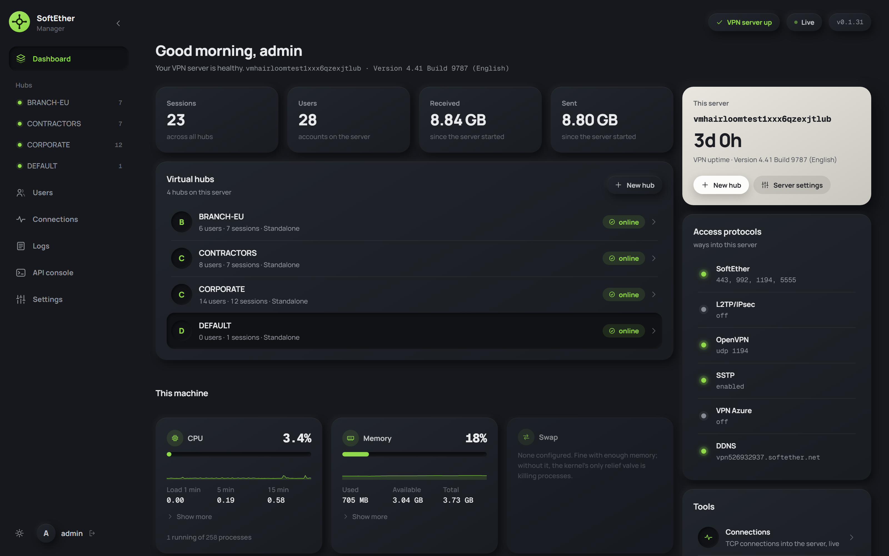

## ویژگی‌ها / What it does


**Watches the machine.** The dashboard opens with the server's own health, read straight
from the kernel: CPU (with per-core detail, load, and steal time — the figure that
explains a slow VPS nothing else accounts for), memory and swap, every real filesystem,
and live network throughput, each with a few minutes of sparkline history.

**Manages the whole of SoftEther.** The panel is built on a complete client for the
SoftEther JSON-RPC suite, and the interface exposes all of it, organised by where things
live:

| | |
| --- | --- |
| **Users** | create, edit, delete; password / certificate / signed / RADIUS / NT auth; group membership; expiry; per-user security policy (all forty knobs, grouped and explained); lifetime transfer counters; usage charts; live sessions with a kill switch; a one-click **.vpn connection file** download (optionally with the credential embedded, hashed the way the client stores it) — plus one **Users** page listing everyone across every hub, sortable by any column and searchable by name, hub, group or note |
| **Traffic limits** | a byte ceiling per config *and* per hub, counting download only, upload only, or both, in MB / GB / TB, measured against the very Transfer figure the tables show — reached, the panel denies the config's access and cuts its sessions (or takes the hub offline), and restores exactly what it found when the limit is raised or the transfer reset. SoftEther cannot zero a counter, so the panel keeps its own zero and every figure it prints subtracts it: **Reset transfer** really does put the column back to 0 B |
| **Groups** | create, edit, delete; group-wide security policy that members inherit |
| **Sessions** | live table with client address, protocol, cipher and transfer; per-session detail with the session's own traffic curve; disconnect; and a session log that outlives the connection, so "who was on last night, from where, moving what" is still answerable in the morning |
| **Access control** | the packet filter (priority, protocol, addresses, ports, users, delay/jitter/loss simulation) and the source-IP limit list |
| **Hub security** | trusted CA certificates, certificate revocation entries, RADIUS delegation, hub password |
| **SecureNAT** | enable/disable, virtual NAT and DHCP configuration, live NAT and lease tables |
| **Cascades** | hub-to-hub links to other servers, with live link status |
| **Switching** | MAC and IP address tables, local bridges, virtual layer-3 switches with interfaces and routes |
| **Server** | listeners, VPN-over-ICMP/DNS, L2TP/IPsec, OpenVPN and SSTP clones, VPN Azure, dynamic DNS, cipher, certificate (view / replace / regenerate), clustering, keep-alive, syslog, EtherIP IDs, a paged browser for the server and security logs, config backup and restore |
| **The panel itself** | a custom domain with a Let's Encrypt certificate the panel obtains and renews on its own, HTTPS on a port of your choosing, and a switch that makes the domain the only way in — a request by IP address gets a bare 404 |

And for anything you want to do *exactly* the way the SoftEther reference describes it,
there is an **API console**: every documented method, its parameter template pre-filled,
callable raw.

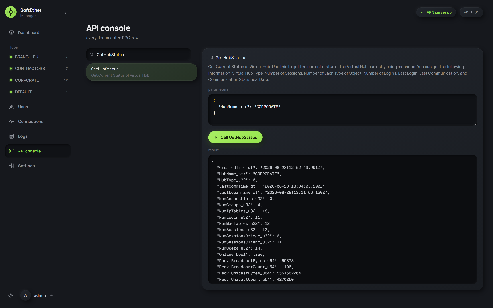

**Draws what the numbers mean.** SoftEther keeps cumulative counters and no history, so
the panel samples them on a schedule and turns the deltas into throughput charts — per
hub, per user, and per session. Each user gets an identity card: who they are, how they
authenticate, what they've moved, whether they're online right now. Every sampler has
its own clock and its own switch in Settings, so a small box can keep the cheap ones and
turn the expensive ones off.

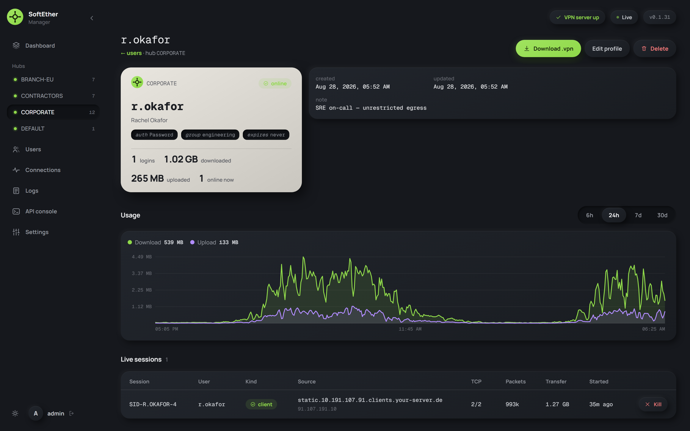

**Stops what has had enough.** Any config, and any hub, can carry a traffic ceiling: an
amount in MB, GB or TB, counting the download, the upload, or the two together. It is
measured against *the number already on screen* — the Transfer column — so a 300 GB
limit set on a config that has moved 144 GB starts at 144 GB, not at nothing. At the
ceiling the config is denied access and its sessions are cut, or the hub is taken
offline; the moment the limit is raised or the transfer reset, exactly the policy the
panel found is put back.

SoftEther counts forever and has no API to zero a counter, so the panel keeps its own
zero and every figure it prints subtracts it. **Reset transfer** moves that zero to
today, which puts the Transfer column and the limit back to nothing together — they
were never two numbers. A limit is edited where it belongs, on the config's profile,
and the user tables carry the meter so a full one is visible without opening anything.

**Says what state everything is in.** Every switch in the panel — a hub's online state, a
listener, SecureNAT, VPN Azure, a cascade, a layer-3 switch, a traffic limit — is a real
switch: it locks while the request is in flight, then shows the state *read back from the
server*, not the state that was clicked. A change that did not take says so, with the
reason, next to the control and in a toast.

More rooms of the house — every user across every hub, who is connected right now, one
Virtual Hub's home, and the whole thing in its light theme:

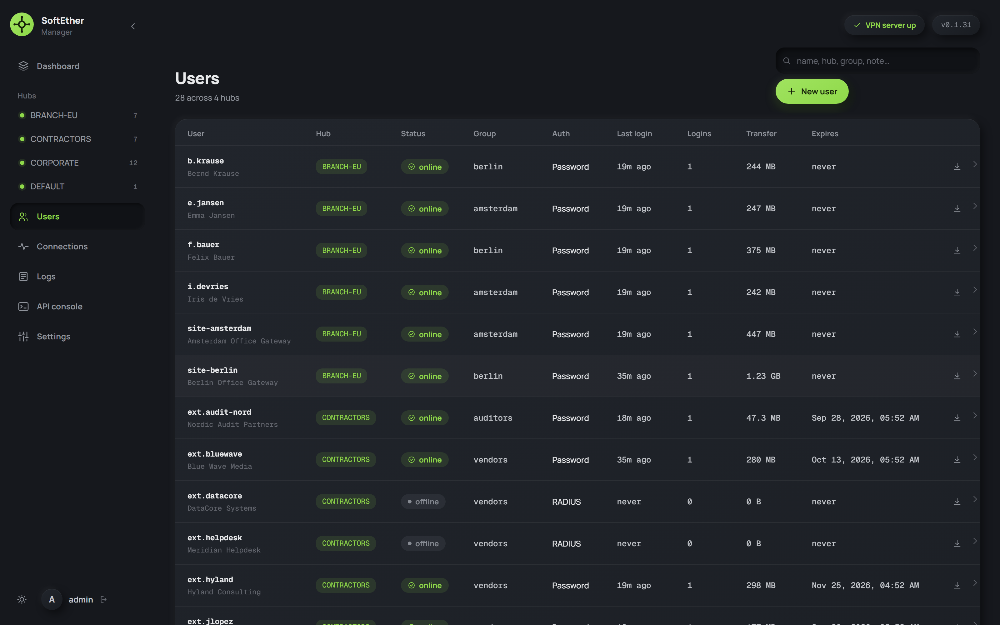

<details>
<summary><b>Sessions</b> — who is connected, from where, over what, moving how much</summary>

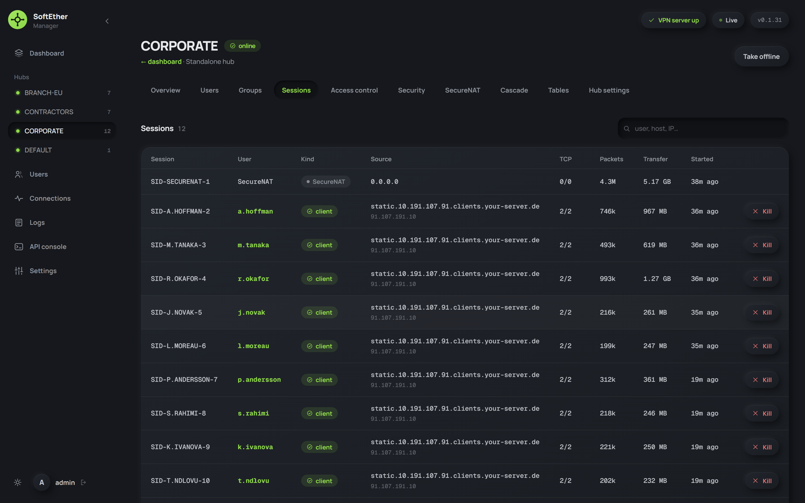
</details>

<details>
<summary><b>Hub overview</b> — status, throughput, and the tabs where everything lives</summary>

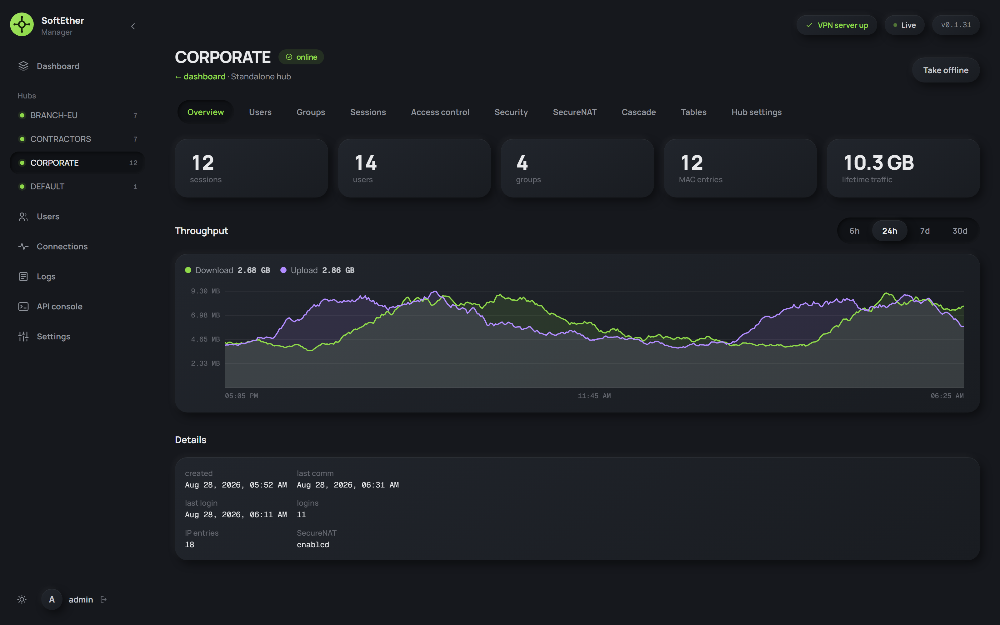
</details>

<details>
<summary><b>Server settings</b> — listeners, protocols, encryption, bridges, L3 switches, clustering…</summary>

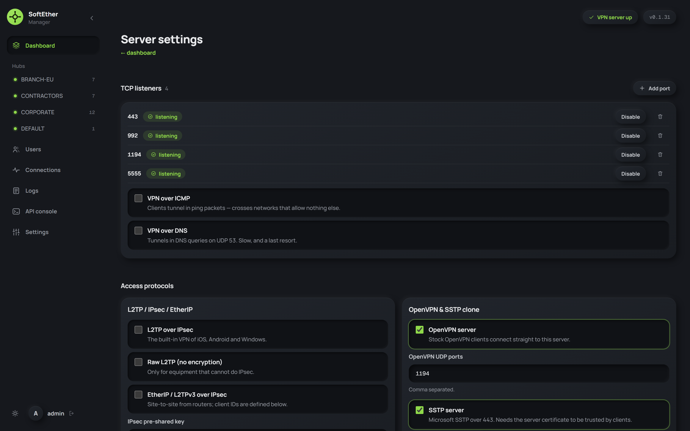
</details>

<details>
<summary><b>Light theme</b> — a first-class mirror, not an inversion</summary>

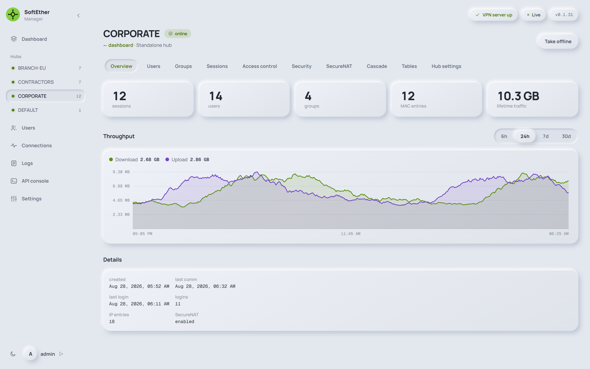
</details>

## The mobile panel

Below 960px the interface becomes a different application, not a squeezed one: a top bar
that knows where you are, a bottom tab bar, cards instead of tables, and bottom sheets
for decisions. Managing a VPN server from a phone is a first-class path.

<p align="center">
  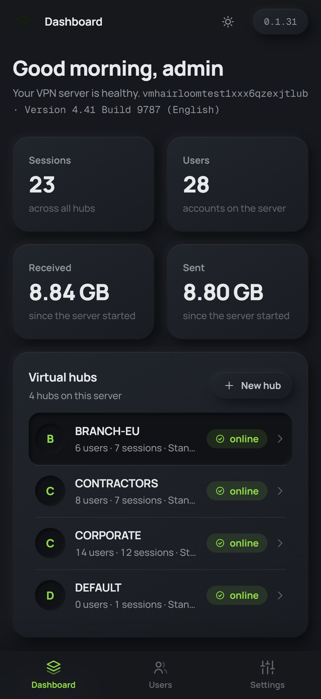
  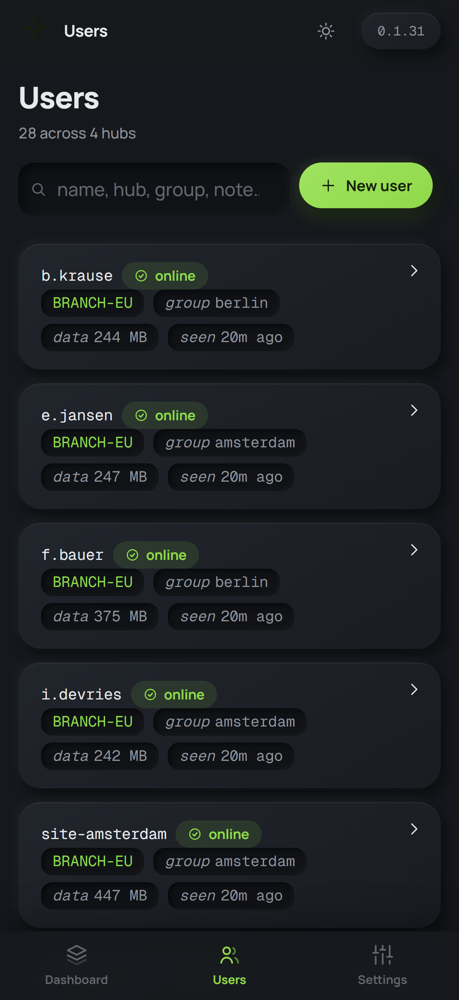
  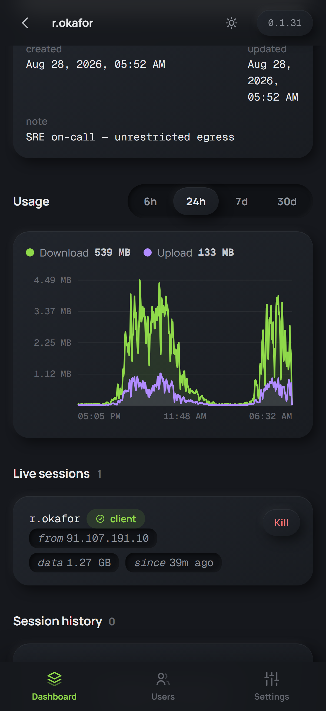
  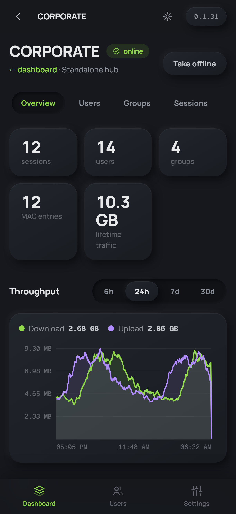
</p>

## Install

On the Linux server that runs (or will run) SoftEther, as root:

```bash
bash <(curl -Ls https://raw.githubusercontent.com/Softether-Manager/master/scripts/install.sh)
```

The installer asks four questions — username, password, port, and a secret web path the
panel hides behind — and answers everything else itself: it installs Python if needed,
downloads the latest release, verifies its checksum, builds a virtualenv, writes a
hardened systemd unit, starts the service and creates your account. There is no database
to set up: the panel keeps everything in one SQLite file under
`/var/lib/softether-manager`, and backing it up is copying that directory.

First sign-in, the panel asks for the SoftEther management port and administrator
password (127.0.0.1:5555 on a stock install), tests them, and connects. From then on it
is the server's control room.

Non-interactive, for automation:

```bash
bash <(curl -Ls https://raw.githubusercontent.com/Softether-Manager/master/scripts/install.sh) \
  --non-interactive --username admin --password '...' --port 8443 --path mysecret --json
```

Running the installer again on a host that already has the panel opens `sem`, the
management CLI, instead of reinstalling:

```
sem status               version, service state and the URL the panel is on
sem update               install the newest release
sem password             reset an account password when nobody can sign in
sem users                list the panel accounts
sem port / sem path      move the panel
sem domain               the domain, its certificate, and domain-only access
sem logs -f              follow the service log
sem uninstall            remove the panel (the database survives unless you say otherwise)
```

### Updating

The panel updates itself: the version pill in the corner checks the releases feed, and
one click installs the new version through the same installer an operator would use —
launched in a transient systemd unit so it survives the restart it performs. A release
that lands while the panel is open announces itself once, with the updater on the
notice. `sem update` does the identical thing from a shell.

### A domain and HTTPS

Point a DNS record at the server, open port 80 and the HTTPS port, and enter the name
under **Settings → Domain & HTTPS**. The panel registers with Let's Encrypt, answers the
validation on port 80, obtains the certificate, starts serving HTTPS on the port you chose
(443 unless SoftEther's own listener is sitting on it — then disable that listener, or
pick another port), keeps port 80 answering with a redirect, and renews the certificate
a month before it expires. Each stage — the domain, its DNS, port 80, the certificate,
the renewal, the HTTPS listener — reports its own state and its own error on the page,
so a record that points elsewhere, a firewall that blocks port 80 and a port SoftEther
already holds read as three different problems, not one "failed". The account key, the
certificate and its private key live in the data directory with everything else the
panel owns.

Once you are using the panel through the domain, **Only serve the panel at this domain**
turns away every request that arrives by IP address or under any other name, on every
port, with the same anonymous 404 the panel's root already gives. The switch is only
offered from the domain itself, so it cannot lock you out; requests from the machine
itself and the certificate validation path are always let through, so renewal and the
installer keep working. If a DNS change ever does strand you, `sem domain only off` on
the server lifts it.

## Scope: one server, on purpose

This panel deliberately manages **only the SoftEther instance on its own machine**. It
holds one connection, one database, one audit trail — which is what makes it simple to
install, simple to reason about, and safe to hand to the machine's operator.

Fleet-level concerns — installing SoftEther on fresh hosts, managing many of these
panels, creating users across instances — belong to a separate master panel that speaks
to many single-server panels like this one. That separation keeps each layer honest:
this panel is the complete, self-sufficient control room for one server; the master
panel (a separate project) orchestrates many of them.

## Architecture

```
/proc, /sys ──┐
              ├──  FastAPI backend  →  Next.js panel
SoftEther ────┘        (app/)          (app/web)
 JSON-RPC  Library/softether.py
```

One monolithic package, one process, one SQLite file:

- **`Library/`** — a dependency-free Python client for the complete SoftEther JSON-RPC
  suite: every method, typed arguments, a real error taxonomy, TLS pinning, retries.
- **`app/`** — the FastAPI backend. It shapes the RPC surface into a REST API
  (`/api/v1/hubs/{hub}/users/...`), reads the machine's health from `/proc`, stores
  panel state in SQLite through a database factory (PostgreSQL later means implementing
  one interface behind `SEM_DATABASE_URL`), samples traffic counters in the background,
  and serves the built frontend.
- **`app/web/`** — the Next.js frontend, exported as a single hash-routed page so the
  same build serves from any secret path prefix. Dark and light themes, desktop and
  mobile shells.

Secrets stay where they belong: the SoftEther administrator password is
Fernet-encrypted in the database; the session-signing and encryption keys are generated
on first start into the data directory, and so are the Let's Encrypt account key and the
panel's certificate; the environment file under `/etc` holds deployment facts only.
Every state-changing action lands in an audit log.

The certificate comes from a small ACME client of the panel's own (`app/services/acme.py`,
HTTP-01 only, on the `cryptography` package the panel already depends on) rather than
from certbot, so there is nothing to install, no cron job, and the service's
`ProtectSystem=full` sandbox stays as tight as it was: everything the certificate needs
is in the data directory.

## Development

```bash
pip install -r requirements.txt
python run.py                        # backend on :8000, serves app/web/out if built

cd app/web
npm install
npm run dev                          # frontend dev server on :3000
NEXT_PUBLIC_API_BASE=http://localhost:8000/ npm run dev   # point it at the backend
```

The library has its own offline test suite — a throwaway TLS server stands in for a VPN
server — with `python -m unittest Library.test_softether`.

Releases are tag-driven: CI builds the frontend, packages one tarball, and publishes it
with a checksum on every `v*` tag. The installer and the in-panel updater both follow
the repository's latest release.

## Security notes

- Out of the box the panel serves plain HTTP. Give it a domain (Settings → Domain &
  HTTPS) and it serves HTTPS with a Let's Encrypt certificate it renews itself; or put a
  TLS-terminating reverse proxy in front of it, or bind it to localhost and reach it over
  an SSH tunnel or WireGuard. A session issued over HTTPS carries a `Secure` cookie and is
  never sent back over the plain port.
- With a domain set, *Only serve the panel at this domain* refuses everything that does
  not name it — the bare IP address included — with an anonymous 404.
- The secret web path keeps scanners out of the login form; it is defence in depth, not
  authentication. The authentication is the account password (scrypt-hashed) and
  HttpOnly session cookies.
- The panel talks to SoftEther on the loopback interface by default, so the management
  password never crosses a network.
